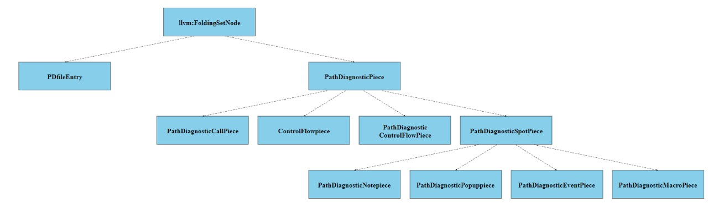

# LLVM Report
### Name: AKHIL NERELLA
### RollNo. : CS19B1020
## C++11/C++14 FEATURES:

* Final keyword:  
     Its a C++11 feature.This keyword is used in Macroargs.h,It is used for preventing inheritance of class.  
     When a class/struct is marked as final then it cant be inherited and cant be used as baseclass.  
     Reference: https://github.com/llvm/llvm-project/blob/main/clang/include/clang/Lex/MacroArgs.h

* delete:  
     This is also a C++ 11 feature used in LLVM.Before C++ 11 the delete operator can only be used to deallocate memory.In the new feature it can also disable usage of a member function.  
     This feature is used : https://github.com/llvm/llvm-project/blob/main/clang/include/clang/Lex/HeaderMap.h

* Explicit keyword:  
 This feature is used to avoid implicit conversions we make constructor explicit using explicit keyword.  
 This feature is used in : https://github.com/llvm/llvm-project/blob/main/clang/include/clang/Lex/MacroInfo.h
     
* nullptr :  
 C++ 11 nullptr replaces C's NULL.nullptr is implicitly convertible and comparable to any pointer type unlike null.
      Reference: https://github.com/llvm/llvm-project/blob/main/clang/include/clang/Lex/MacroArgs.h
      
* unique_ptr :  
 Its a smart pointer if it goes out of scope deletes the object pointing to.  
 Reference:https://github.com/llvm-mirror/clang/blob/master/include/clang/Lex/HeaderMap.h  
 https://github.com/llvm-mirror/clang/blob/master/include/clang/Frontend/SerializedDiagnosticPrinter.h

* noexcept :  
 noexcept specifier tells whether a function could throw exceptions.Improved version of throw().     
* template -  
 Its used for generic programmming.  
 This feature is used in:https://github.com/llvm/llvm-project/blob/main/clang/include/clang/Lex/MacroInfo.h
* constexpr :  
 Constant expression are evaluated by compiler at compiletime.Only non-complex computation are done here.We use this to indicate variable/function.  
 Reference: https://github.com/llvm-mirror/clang/blob/master/include/clang/ASTMatchers/ASTMatchersInternal.h
* std::move -  
 Object passed to it transfers resources.  
 https://github.com/llvm/llvm-project/blob/main/clang/lib/Frontend/ASTUnit.cpp		
* Non-static data member initialiser:  
 It allows nonstatic datamembers to initialise when declared for cleaning up constructors. 	
* auto :  
 Auto variables are deduced by compiler acc. to type of which it is assigned.  
      https://github.com/llvm/llvm-project/blob/main/clang/lib/Frontend/ASTUnit.cpp
* default :  
 Provides a default implementation of a function.  
      https://github.com/llvm-mirror/clang/blob/master/include/clang/Lex/Pragma.h
* using  :  
 Similar to typedef in "C".  
      https://github.com/llvm-mirror/clang/blob/master/include/clang/Lex/HeaderSearch.h
* Rangebased for loop -  
 For iterating over a rrange in a containerCompilerInvocation.cpp.  
   Reference:https://github.com/llvm/llvm-project/blob/main/clang/lib/Frontend/CompilerInvocation.cpp
* Static_assert -  
 To check if a condition is true when code is compiled else issues an error.  
 Reference:https://github.com/llvm-mirror/clang/blob/master/include/clang/ASTMatchers/ASTMatchersInternal.h

## Class Hierarchy

  
This is a class hierarchy of a file in LLVM showing inheritance.This of Hierarchical Inheritance of llvm:FoldingsetNode class(base class) and more than one derived class is created from single base class.
Reference:https://github.com/llvm/llvmproject/blob/main/clang/include/clang/Analysis/PathDiagnostic.h

## Design Decisions
 ### Abstraction :
 In abstraction we make different files for defining and declaring the methods of a class such as header and cpp files.This makes user know only what the defined methods are,and  the how those methods are implemented are not showed to the user.So,user can use these methods.We also use this in LLVM i.e. maintain separate files.We also use abstraction in classes that is make public and private variables such that user can have restricted access to the private variable(acces through member functions).  
 Reference :https://github.com/llvm/llvm-project/blob/main/clang/include/clang/Frontend/CompilerInvocation.h
 ### Inheritance :  
  We use inheritance to reduce the redundancy of data.By using inheritance,A class can derive functions and variables from another class.The above class hirerachy shows the hirerachial inheritance.  
  Reference: https://github.com/llvm/llvmproject/blob/main/clang/include/clang/Analysis/PathDiagnostic.h
 ### Modularity :  
 We make separate modules in a code such that each module does different tasks.LLVM also uses Modularity.  
 Reference:https://github.com/llvm/llvm-project/tree/main/clang/include/clang/Lex
      
 ### Encapsulation :  
   We group the variables and member functions that manipulate these variables to make a class.  
   Reference:https://github.com/llvm/llvm-project/blob/main/clang/include/clang/Lex/MacroArgs.h
     
### Polymorphism :  
   When multiple functions has same name but has different parameters then these functions are said to be overloaded..This means this function is taking many forms.  
   https://github.com/llvm/llvm-project/blob/main/clang/include/clang/Rewrite/Frontend/FrontendActions.h  
   
## Design Patterns
  Factory Pattern is also used as one of  Design Patterns in LLVM Code. 
  https://github.com/llvm/llvm-project/blob/main/clang/include/clang/Tooling/Tooling.h
  
  Observer Pattern,when an object is modified.its dependent objects should be notified automatically.This pattern is also used in LLVM code.  
  https://github.com/llvm/llvm-project/blob/main/clang/include/clang/Analysis/Analyses/LiveVariables.h
  
## Usage of iterators and their own data structures  
 Iterators(iterator) are used to point at containers and const_iterator are used only to access but cannnot modify in containers.begin and end are implemented in iterator.  iterator,const_iterator,reverse_iterator,const_reverse_iterator are the used iterators in the below references of LLVM.  
 https://github.com/llvm/llvm-project/blob/main/clang/examples/PrintFunctionNames/PrintFunctionNames.cpp  
https://github.com/llvm/llvm-project/blob/main/llvm/include/llvm/ADT/SmallVector.h  

 Datastructures of iterators used in LLVM are Arrayref , ReferenceProxy , iterator_adaptor_base , iterator_facade_base , pointee_iterator, WrappedPairNodeDataIterator .  
 https://github.com/llvm/llvm-project/blob/main/llvm/include/llvm/ADT/iterator.h  
 https://github.com/llvm/llvm-project/blob/main/llvm/include/llvm/ADT/ArrayRef.h
